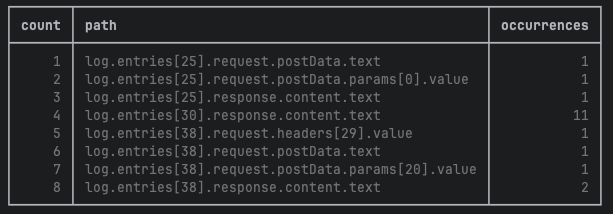

Facebook Request Replication with Express

This project replicates a specific Facebook Graph API request using an Express server. The server dynamically extracts and uses headers and POST data from a `.har` file to replicate the request for different profile IDs.<br><br>

##### Places where "ProfileCometHeaderQuery" appears in the ```.har``` file:


Getting Started

To run this project, you'll need Node.js installed on your system. The steps below outline the process to set up and run the server.

Prerequisites

    Node.js (v14.0.0 or higher)
    npm (v6.0.0 or higher)

Installation

    Clone the repo:
    git clone https://your-repository-link-here.git
    Install NPM packages:
    npm install

Usage

Run the server using the following command:

    npm dev

The server will start on http://localhost:3000. To replicate a Facebook request, navigate to:

    http://localhost:3000/replicate-request/{userId}

Replace {userId} with the profile ID you want to query.

Code Structure

    - src/index.ts: Contains the Express server setup and the endpoint to handle the Facebook request replication.
    - findPaths-ProfileCometHeaderQuery.js: Script that analyzes the .har file to identify necessary information for the request replication.

Output Visualization

The ProfileCometHeaderQuery-Shows.png image provides a visual summary of the script's output for easier understanding of the data flow.

Contributing

Contributions are welcome. Please open an issue first to discuss what you would like to change or submit a pull request.

License

This project is licensed under the MIT License - see the LICENSE file for details.
